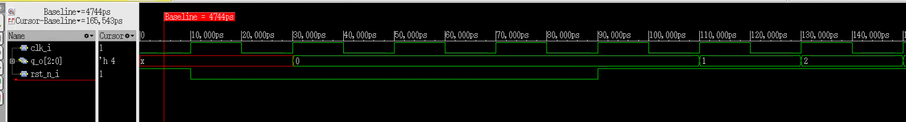

### Estudiantes:
- Elías Miranda Cedeño 
- Xavier Barrios Salazar
- Keylor Rivera Gamboa

# Punto 7 Análisis Comparativo de Timing entre Esquinas PVT

## Variación de Delays por Esquina

### DFFX0 (D Flip-Flop)
| Parámetro | Típica (TT) | Fast (FF) | Slow (SS) | Ratio SS/FF |
|-----------|-------------|-----------|-----------|-------------|
| Setup Time (rise) | 0.1845ns | 0.1258ns | 0.3206ns | **2.55x** |
| Setup Time (fall) | 0.3768ns | 0.2773ns | 0.5623ns | **2.03x** |
| Clock-to-Q (tphl) | 0.2804ns | 0.2029ns | 0.4759ns | **2.34x** |
| Clock-to-Q (tplh) | 0.4586ns | 0.3292ns | 0.7563ns | **2.30x** |

### INVX0 (Inversor)
| Parámetro | Típica (TT) | Fast (FF) | Slow (SS) | Ratio SS/FF |
|-----------|-------------|-----------|-----------|-------------|
| Delay A→Y (tphl) | 0.0386ns | 0.0292ns | 0.0594ns | **2.03x** |
| Delay A→Y (tplh) | 0.0254ns | 0.0195ns | 0.0378ns | **1.94x** |

### NANDX0 (Compuerta NAND)
| Parámetro | Típica (TT) | Fast (FF) | Slow (SS) | Ratio SS/FF |
|-----------|-------------|-----------|-----------|-------------|
| Delay A→Y (tphl) | 0.0459ns | 0.0344ns | 0.0708ns | **2.06x** |
| Delay B→Y (tphl) | 0.0614ns | 0.0461ns | 0.0937ns | **2.03x** |

### NORX0 (Compuerta NOR)
| Parámetro | Típica (TT) | Fast (FF) | Slow (SS) | Ratio SS/FF |
|-----------|-------------|-----------|-----------|-------------|
| Delay A→Y (tphl) | 0.0792ns | 0.0553ns | 0.1338ns | **2.42x** |
| Delay B→Y (tphl) | 0.1170ns | 0.0818ns | 0.1981ns | **2.42x** |

## Variación de Potencia Estática

### Potencia por fuga por cada Esquina
| Celda | Típica (TT) | Fast (FF) | Slow (SS) | Ratio SS/FF |
|-------|-------------|-----------|-----------|-------------|
| DFFX0 | 0.00422nW | 0.00026nW | **0.54232nW** | **2086x** |
| INVX0 | 0.00081nW | 0.00027nW | **0.05784nW** | **214x** |
| NANDX0 | 0.00177nW | 0.00038nW | **0.09743nW** | **256x** |
| NORX0 | 0.00082nW | 0.00028nW | **0.05995nW** | **214x** |

## Características de Capacitancia de Entrada

### Variación de la capacitancia de entrada
Las capacitancias de entrada permanecen **relativamente estables** entre esquinas:
- **INVX0**: 0.00247pF (TT) → 0.00263pF (FF) → 0.00235pF (SS)

## Observaciones importantes

### 1. **Timing Scalability**
- **Factor de variación típico**: 2.0x a 2.5x entre Fast y Slow
- **DFF más sensible**: Setup times muestran mayor variación
- **Elementos combinacionales**: Variación más consistente

### 2. **Power Exponential Impact**
- **Leakage power**: Incremento exponencial en esquina Slow (alta temperatura)
- **Factor de aumento**: 200x a 2000x del Fast al Slow corner
- **Temperatura dominante**: El efecto térmico supera al de voltaje/proceso

### 3. **Setup vs Hold Timing**
- **Setup times**: Altamente sensibles a PVT (crítico para timing closure)
- **Hold times**: Menor variación relativa, pero pueden volverse negativos

### 4. **Implicaciones para Diseño**
- **Timing analysis**: Usar Slow corner para setup, Fast corner para hold
- **Power budgeting**: Considerar worst-case térmico para leakage
- **Yield optimization**: El spread de 2.5x requiere margins significativos

# Punto 8

- El contador cuenta con reset síncrono activo en bajo
- ancho de la salida es de 3 bits lo que permite contar hasta 7 en decimal
- Incrementa en 1 por cada ciclo de reloj
- sensible al flanco positivo del reloj
- Unidad de tiempo igual a 1ns
- Precisión 1ps

### Constraints

- Indican que el circuito va a operar a 100MHz
- Indican que el tiempo de para que la logica combinacional opere entre dos flip flops es de 8.7ns

# Punto 10

Como se puede observar son los resultados esperados, ya que:

- Se tiene un reset síncrono
- Efectivamente el ancho de la salida es de 3 bits
- Se incrementa en 1 por cada flanco de reloj
- La frecuencia de operación del reloj es de 50Mhz 

# Punto 12

- Como primer paso el programa carga los scrips
- Segundo paso, se lee el diseño
- Tercer paso, se procede a elaborar el diseño
- Cuarto paso, se leen los constraints, indica si los comandos ejecutados fueron exitosos o no.
- Hace un mapeo a la tecnologia utilizada
- Optimiza la sintesis
- reporte de sintesis
- archivos resultantes