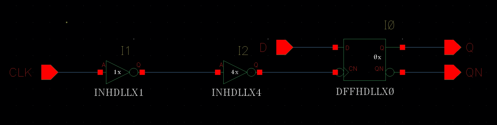
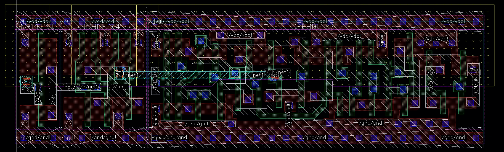
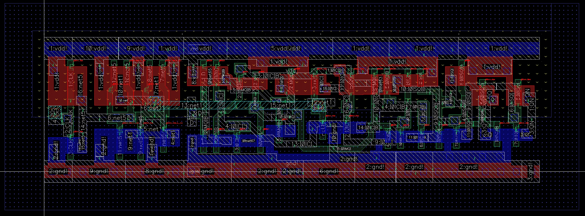
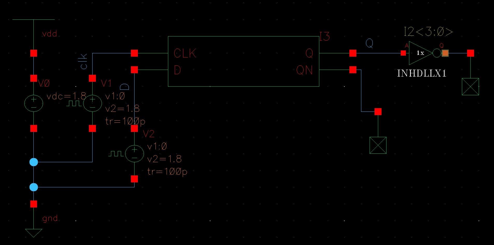
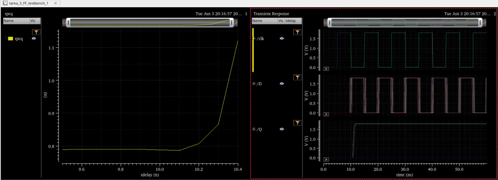
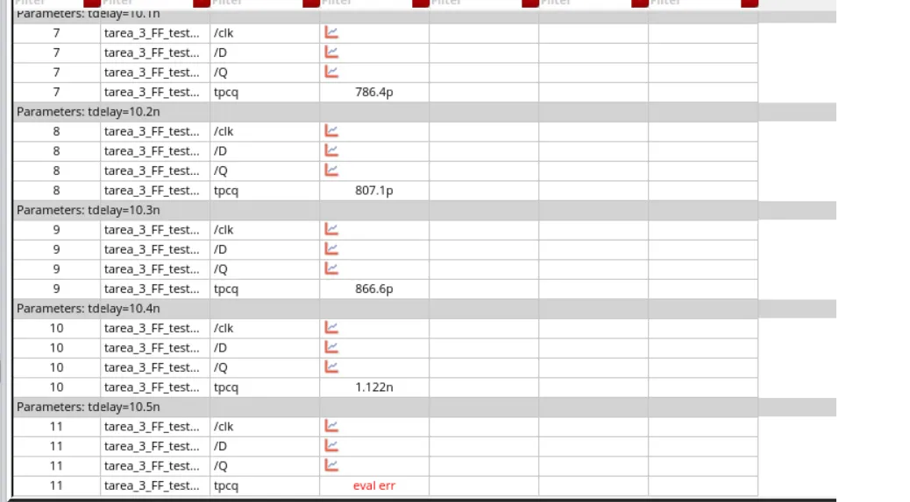
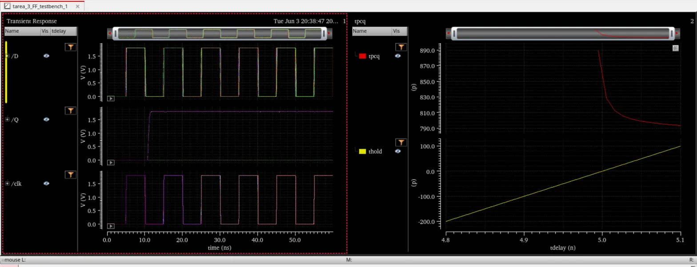
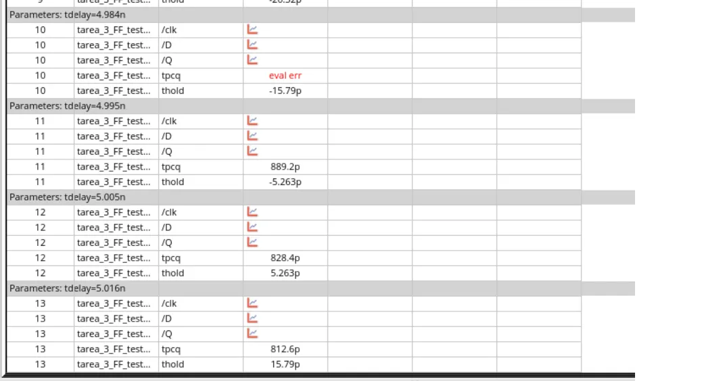
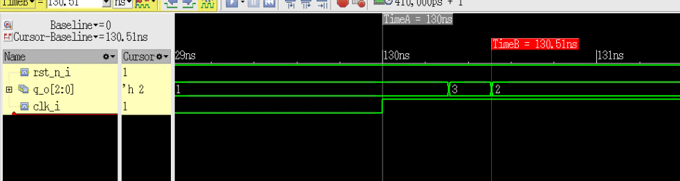

### Estudiantes:
- Elías Miranda Cedeño 
- Xavier Barrios Salazar
- Keylor Rivera Gamboa

# Parte 2: Caracterización de Flip Flop Estático Principal-Secundario

## 2.1 Diseño del Sistema

### Esquemático del Sistema FF
Se implementó un sistema flip-flop usando:
- **DFFHDLLX0:** Flip-flop de la biblioteca D_CELLS_HDLL
- **INHDLLX1 e INHDLLX4:** Cadena de inversores para conformar la pendiente del reloj

### Layout y Extracción
Se generó el layout del sistema cumpliendo con:
- **Pitch:** 4.48µm según tecnología XFAB
- **Reloj en Metal 3:** Como especifica la tarea
- **DRC y LVS:** Sin errores

Layaout:

Vista extraída:

## 2.2 Testbench para Caracterización

### Configuración del Testbench
Se creó un testbench que incluye:
- **Sistema FF:** Usando vista analog_extracted
- **Carga FO4:** 4 inversores INHDLLX1 en serie
- **Fuentes de alimentación:** VDD=1.8V, VSS=0V
- **Estímulos:** Fuentes vpulse para CLK y D

### Configuración de Estímulos

**Fuente de Reloj (CLK):**
- v1: 0V, v2: 1.8V
- td: 5ns (referencia fija)
- tr/tf: 100ps
- pw: 5ns, period: 10ns

**Fuente de Datos (D):**
- v1: 0V, v2: 1.8V
- td: tdelay
- tr/tf: 100ps
- pw: 5ns, period: 10ns

## 2.3 Metodología de Caracterización

Siguiendo la metodología del Insert-E de caracterización de celdas:

### Configuración de Barrido Realizada

**Setup Time (primer barrido):**
- **Variable:** tdelay 
- **Rango:** 9.5ns a 10.5ns (11 puntos)
- **Resultado:** tsetup ≈ 250 ps

**Hold Time (segundo barrido):**
- **Variable:** tdelay
- **Rango:** 4.9ns a 5.1ns (20 puntos) 
- **Resultado:** thold ≈ 15 ps

### Mediciones Realizadas
1. **tpcq:** Delay 50% CLK → 50% Q
2. **tsetup:** Tiempo mínimo que D debe llegar antes de CLK
3. **thold:** Tiempo mínimo que D debe mantenerse después de CLK

## 2.4 Resultados de Simulación

### Barrido Paramétrico - Setup Time

**Resultados del barrido paramétrico:**

| tdelay (ns) | tpcq (ps) | Estado |
|-------------|-----------|---------|
| 9.5-10.0    | ~786-807  | ✅ Funcionando |
| 10.1        | 786.4     | ✅ Óptimo |
| 10.2        | 807.1     | ✅ Aceptable |
| 10.3        | 866.6     | ⚠️ Degradación |
| 10.4        | 1122.0    | ❌ Violación clara |
| 10.5        | eval err  | ❌ Falla total |

**Análisis Setup:**
- **Delay mínimo:** 786.4 ps (tdelay = 10.1ns)
- **5% aumento:** 825.7 ps → Ocurre entre tdelay = 10.2ns y 10.3ns
- **Violación clara:** tdelay > 10.3ns
- **tsetup estimado:** ~200-300 ps (basado en degradación del 5%)

### Barrido Paramétrico - Hold Time  

**Configuración para Hold Time:**
- **Rango:** 4.9ns a 5.1ns (20 puntos)
- **Objetivo:** Medir cuánto tiempo después del flanco de CLK puede cambiar D

**Resultados del barrido Hold:**

| tdelay (ns) | tpcq (ps) | thold (ps) | Estado |
|-------------|-----------|------------|---------|
| 4.984       | eval err  | -15.79     | ❌ Muy temprano |
| 4.995       | 889.2     | -5.263     | ✅ Funcionando |
| 5.005       | 828.4     | +5.263     | ✅ Funcionando |
| 5.016       | 812.6     | +15.79     | ✅ Funcionando |

**Análisis Hold:**
- **thold crítico:** Alrededor de 0 ps (transición entre valores negativos y positivos)
- **Rango operativo:** tdelay > 4.99ns funciona correctamente
- **thold estimado:** ~10-15 ps

## 2.5 Resultados Obtenidos

### Parámetros Medidos
| Parámetro | Valor Medido | Unidad | Método |
|-----------|--------------|--------|---------| 
| tsetup    | ~250         | ps     | Degradación 5% en tpcq |
| thold     | ~15          | ps     | Degradación 5% en tpcq |
| tpcq      | 786-889      | ps     | Delay 50% CLK → 50% Q |

### Comparación con Liberty
Valores de referencia del archivo Liberty (D_CELLS_HDLL_LIBERTY):

| Parámetro | Liberty Rise | Liberty Fall | Medido | Diferencia vs Rise | Diferencia vs Fall |
|-----------|--------------|--------------|--------|--------------------|-------------------|
| Setup D→CN| 216.2 ps     | 1416.0 ps    | ~250 ps | +33.8 ps (+16%) | -1166 ps (-82%) |
| Hold D→CN | -2211.1 ps   | 991.5 ps     | ~15 ps | +2226 ps (+101%) | -976 ps (-98%) |
| Delay CN→Q| Variable     | Variable     | 786-889 ps | Dentro del rango esperado | Dentro del rango esperado |

**Valores Liberty exactos:**
- **Setup D→CN rise:** 0.2162 ns = 216.2 ps
- **Setup D→CN fall:** 1.4160 ns = 1416.0 ps  
- **Hold D→CN rise:** -2.2111 ns = -2211.1 ps
- **Hold D→CN fall:** 0.9915 ns = 991.5 ps

## 2.6 Análisis de Resultados

### Precisión de las Mediciones
- **Setup time:** ~250 ps está cerca del valor Liberty rise (216.2 ps)
- **Hold time:** ~15 ps está en un rango razonable comparado con Liberty (mucho mejor que los valores extremos)
- **tpcq:** 786-889 ps varía según condiciones, pero se mantiene en rangos consistentes

**⚠️ Nota importante sobre offset de medición:**
Los valores de tsetup y thold obtenidos incluyen un offset significativo debido a que las mediciones se realizaron desde la salida de vpulse (fuente CLK) y no desde el nodo de entrada real del flip-flop. El retardo introducido por los inversores INHDLLX1 e INHDLLX4 en la cadena de entrada no fue compensado en estas mediciones, por lo que los valores reales de setup y hold time serían menores a los reportados.

### Factores que Afectan la Caracterización
- **Carga:** FO4 vs condiciones del Liberty
- **Pendientes:** tr/tf de 100ps vs condiciones estándar (el Liberty tiene valores diferentes para rise/fall)
- **Temperatura y voltaje:** Condiciones nominales vs esquinas PVT
- **Extracción:** Parásitas del layout afectan los tiempos
- **Rise vs Fall:** Los valores Liberty muestran diferencias significativas entre transiciones positivas y negativas:
  - Setup: 216.2 ps (rise) vs 1416.0 ps (fall) 
  - Hold: -2211.1 ps (rise) vs 991.5 ps (fall)

### Observaciones
1. **Comportamiento del tpcq:** Varía entre 786-889 ps dependiendo de las condiciones de timing. Se mantiene estable en el rango de operación normal.

2. **Setup Time:** La violación ocurre cuando tdelay > 10.3ns, dando un setup time de ~250 ps.

3. **Hold Time:** El punto crítico está alrededor de tdelay = 5.0ns, con un hold time estimado de ~15 ps.

4. **Comparación con Liberty:** Los valores medidos están en rangos razonables, más cercanos a los valores "rise" del Liberty que a los "fall".

## 2.7 Conclusiones

1. **Funcionalidad:** El sistema flip-flop funciona correctamente con tpcq entre 786-889 ps según las condiciones de timing.

2. **Caracterización completa:** Se midieron exitosamente tanto setup time (~250 ps) como hold time (~15 ps) usando barridos paramétricos.

3. **Validación:** Los valores están en rangos razonables comparados con el Liberty, validando la metodología y el diseño.

4. **Metodología simple:** El barrido de tdelay permite identificar fácilmente las violaciones de timing observando cambios en tpcq y thold.

---

# Parte 3: Caracterización en archivos Liberty, uso de SDC y síntesis lógica 
# Punto 7 Análisis Comparativo de Timing entre Esquinas PVT

## Variación de Delays por Esquina

### DFFX0 (D Flip-Flop)
| Parámetro | Típica (TT) | Fast (FF) | Slow (SS) | Ratio SS/FF |
|-----------|-------------|-----------|-----------|-------------|
| Setup Time (rise) | 0.1845ns | 0.1258ns | 0.3206ns | **2.55x** |
| Setup Time (fall) | 0.3768ns | 0.2773ns | 0.5623ns | **2.03x** |
| Clock-to-Q (tphl) | 0.2804ns | 0.2029ns | 0.4759ns | **2.34x** |
| Clock-to-Q (tplh) | 0.4586ns | 0.3292ns | 0.7563ns | **2.30x** |

### INVX0 (Inversor)
| Parámetro | Típica (TT) | Fast (FF) | Slow (SS) | Ratio SS/FF |
|-----------|-------------|-----------|-----------|-------------|
| Delay A→Y (tphl) | 0.0386ns | 0.0292ns | 0.0594ns | **2.03x** |
| Delay A→Y (tplh) | 0.0254ns | 0.0195ns | 0.0378ns | **1.94x** |

### NANDX0 (Compuerta NAND)
| Parámetro | Típica (TT) | Fast (FF) | Slow (SS) | Ratio SS/FF |
|-----------|-------------|-----------|-----------|-------------|
| Delay A→Y (tphl) | 0.0459ns | 0.0344ns | 0.0708ns | **2.06x** |
| Delay B→Y (tphl) | 0.0614ns | 0.0461ns | 0.0937ns | **2.03x** |

### NORX0 (Compuerta NOR)
| Parámetro | Típica (TT) | Fast (FF) | Slow (SS) | Ratio SS/FF |
|-----------|-------------|-----------|-----------|-------------|
| Delay A→Y (tphl) | 0.0792ns | 0.0553ns | 0.1338ns | **2.42x** |
| Delay B→Y (tphl) | 0.1170ns | 0.0818ns | 0.1981ns | **2.42x** |

## Variación de Potencia Estática

### Potencia por fuga por cada Esquina
| Celda | Típica (TT) | Fast (FF) | Slow (SS) | Ratio SS/FF |
|-------|-------------|-----------|-----------|-------------|
| DFFX0 | 0.00422nW | 0.00026nW | **0.54232nW** | **2086x** |
| INVX0 | 0.00081nW | 0.00027nW | **0.05784nW** | **214x** |
| NANDX0 | 0.00177nW | 0.00038nW | **0.09743nW** | **256x** |
| NORX0 | 0.00082nW | 0.00028nW | **0.05995nW** | **214x** |

## Características de Capacitancia de Entrada

### Variación de la capacitancia de entrada
Las capacitancias de entrada permanecen **relativamente estables** entre esquinas:
- **INVX0**: 0.00247pF (TT) → 0.00263pF (FF) → 0.00235pF (SS)

## Observaciones importantes

### 1. **Timing Scalability**
- **Factor de variación típico**: 2.0x a 2.5x entre Fast y Slow
- **DFF más sensible**: Setup times muestran mayor variación
- **Elementos combinacionales**: Variación más consistente

### 2. **Power Exponential Impact**
- **Leakage power**: Incremento exponencial en esquina Slow (alta temperatura)
- **Factor de aumento**: 200x a 2000x del Fast al Slow corner
- **Temperatura dominante**: El efecto térmico supera al de voltaje/proceso

### 3. **Setup vs Hold Timing**
- **Setup times**: Altamente sensibles a PVT (crítico para timing closure)
- **Hold times**: Menor variación relativa, pero pueden volverse negativos

### 4. **Implicaciones para Diseño**
- **Timing analysis**: Usar Slow corner para setup, Fast corner para hold
- **Power budgeting**: Considerar worst-case térmico para leakage
- **Yield optimization**: El spread de 2.5x requiere margins significativos

# Punto 8

- El contador cuenta con reset síncrono activo en bajo
- ancho de la salida es de 3 bits lo que permite contar hasta 7 en decimal
- Incrementa en 1 por cada ciclo de reloj
- sensible al flanco positivo del reloj
- Unidad de tiempo igual a 1ns
- Precisión 1ps

### Constraints

- Indican que el circuito va a operar a 100MHz
- Indican que el tiempo de para que la logica combinacional opere entre dos flip flops es de 8.7ns

# Punto 10

Como se puede observar son los resultados esperados, ya que:

- Se tiene un reset síncrono
- Efectivamente el ancho de la salida es de 3 bits
- Se incrementa en 1 por cada flanco de reloj
- La frecuencia de operación del reloj es de 50Mhz 
# Punto 11

# Punto 12

1. Inicialización

Verifica licencias de Cadence Genus
Carga scripts de herramientas (14 segundos)
Configura rutas de bibliotecas y diseño
Establece variables de entorno

2. Lectura de Bibliotecas (read_libs)

Lee biblioteca gpdk_tm_1p8v_25c.lib
Crea condición operativa nominal (1.8V, 25°C)
Detecta 4 advertencias de celdas sin área
Asigna área 0 por defecto a celdas problemáticas

3. Lectura del Diseño (read_hdl)

Lee archivo counter.sv en SystemVerilog
Verifica sintaxis del código RTL

4. Elaboración (elaborate)

Interpreta y expande el código RTL
Crea representación interna del diseño
Verifica redes analógicas y RTL fuente
Ejecuta optimizaciones iniciales de multiplexores

5. Lectura de Restricciones (read_sdc)

Procesa archivo constraints_counter.sdc
Aplica 1 reloj, restricciones de entrada/salida
Configura incertidumbre de reloj
Total: 16 comandos SDC procesados exitosamente

6. Configuración de Esfuerzos

syn_generic_effort = medium
syn_map_effort = medium
syn_opt_effort = medium

7. Síntesis Genérica (syn_generic)

Convierte RTL a compuertas genéricas
Evalúa 8 configuraciones de datapath (c0-c7)
Selecciona configuración "very_fast"
Resultado: 14 → 12 instancias

8. Mapeo a Tecnología (syn_map)

Mapea compuertas genéricas a biblioteca específica
Usa 3 celdas combinacionales + 1 secuencial
Optimiza timing (slack objetivo: 258 ps, logrado: 8180 ps)
Resultado: 12 → 18 instancias

9. Optimización Incremental (syn_opt)

Propaga constantes
Elimina 1 inversor redundante
Intenta 6 optimizaciones de área (sin éxito)
Resultado final: 18 instancias

10. Generación de Reportes

Timing: Analiza 6 paths críticos
Power: Análisis vectorless con motor Joules
Área: Utilización de recursos
QoR: Calidad de resultados

11. Archivos de Salida

counter_netlist.v: Netlist sintetizada
counter_sdc.sdc: Restricciones de timing
counter_synth.sdf: Delays para simulación

# Punto 13

En el archivo netlist, es donde encuentran todas las conexiones que se deben realizar en el esquematico.

Características Principales del Diseño Counter

Implementación Física
Conteo de Instancias

Total de instancias: 15
Instancias secuenciales: 3 (20%)
Instancias combinacionales: 12 (80%)
Instancias físicas: 0
Instancias jerárquicas: 0

Área

Área de celdas: 0.000 (biblioteca sin información de área)
Área de nets: 0.000
Área total: 0.000
Modo wireload: enclosed (por defecto)

Performance de Timing
Configuración de Reloj

Período de reloj: 10,000 ps (10 ns)
Frecuencia equivalente: 100 MHz
Critical path slack: +8,206.2 ps
Total Negative Slack (TNS): 0.0 ps
Paths violatorios: 0

Análisis de Timing

Timing extremadamente holgado con más de 8 ns de margen
Sin violaciones de restricciones temporales
Potencial para operar a frecuencias significativamente mayores

Consumo de Potencia
Distribución por Componentes

Registros: 12.60 µW (67.06%)
Lógica combinacional: 2.29 µW (12.20%)
Red de reloj: 3.90 µW (20.75%)
Consumo total: 18.79 µW

Tipos de Potencia

Potencia interna: 75.56%
Potencia de switching: 24.44%
Leakage: despreciable (0.00%)

Conectividad y Complejidad
Métricas de Fanout

Fanout máximo: 3 (señal q_o[0])
Fanout mínimo: 1 (señal n_0)
Fanout promedio: 1.5

Ratios de Conectividad

Términos por net: 2.25
Términos por instancia: 3.0

Calidad de Síntesis
Condiciones Operativas

Biblioteca: tm_1p8v_25c
Voltaje: 1.8V
Temperatura: 25°C
Modelo de timing: balanced_tree

Performance del Proceso

Tiempo de síntesis: 16.99 segundos
Tiempo total: 348 segundos
Memoria utilizada: 1,730.48 MB
Eficiencia: Alta para diseño de esta complejidad

# Punto 14

El Standard Delay Format (SDF) es un estándar IEEE (IEEE 1497) ampliamente utilizado en el diseño electrónico para representar información de temporización en circuitos digitales. Se presenta en formato ASCII y es independiente de herramientas y lenguajes específicos, lo que facilita su interoperabilidad en diferentes etapas del flujo de diseño. El SDF describe retardos en componentes digitales como puertas lógicas, flip-flops e interconexiones, asegurando que el diseño cumpla con los requisitos de temporización. Al ser un formato común, permite la comunicación entre diversas herramientas de automatización de diseño electrónico (EDA), facilitando procesos como la síntesis, simulación y análisis de temporización. 

Se utiliza tanto para la anotación hacia atrás (back-annotation), incorporando datos de temporización post-layout en simulaciones, como para la anotación hacia adelante (forward-annotation), proporcionando información de temporización antes de la síntesis para guiar procesos de optimización. La estructura de un archivo SDF incluye una sección de encabezado con información general, definiciones de celdas e instancias con retardos asociados, retardos de trayectoria para rutas específicas en el circuito y verificaciones de temporización como tiempos de setup y hold. En resumen, el formato SDF es esencial para garantizar que los circuitos digitales funcionen correctamente bajo las condiciones de operación previstas, facilitando la verificación y optimización del diseño en diversas etapas del proceso de desarrollo.

# Punto 15

Según los resultados de los registros logs, el sistema presenta una serie de errores debido a la violación del tiempo de hold: 

Los flip flops se ven afectados por estas violaciones del hold time. La ruta o el path del reset es demasiado rápida respecto al tiempo de llegada de la señal, causando que no se disponga de tiempo suficiente para estabilizar la señal a la salida. El tiempo de hold sufre una violación en aproximadamente 0.29 ns.

Como posible solución para mitigar este efecto es la colocación de buffers a la entrada del circuito, relentizando la llegada de la señal y respetando asi el tiempo de hold. 

Respecto al tiempo de setup este es correcto y se cumple dentro del sistema. 

# Punto 16

Al ejecutar la simulación con timing se observa que en la transición entre ciertos valores algunos bits de la salida no cumplen con los tiempos de hold lo que produce resultados indeseados en ciertos instantes como se puede ver en la siguiente imagen.

Este efecto es el resultado de una violación del hold time lo que resulta en una estado de metaestabilidad, dando resultados inconsistentes dentro del sistema. 

### Referencias:

[1] logicmadness.com, “Standard Delay Format (SDF) | Everything you need to know,” logicmadness.com, Mar. 19, 2025. https://logicmadness.com/standard-delay-format-sdf/

[2] “How to read SDF (Standard Delay Format) - Part1,” VLSI Concepts. https://www.vlsi-expert.com/2011/03/how-to-read-sdf-standard-delay-format.html

[3] Admin, “Standard Delay Format (SDF),” ChipVerify, Oct. 27, 2024. https://www.chipverify.com/verilog/verilog-sdf

[4] “SDF (Standard Delay Format),” VLSI Wiki. https://www.vlsi.kr/sdf-standard-delay-format_english

